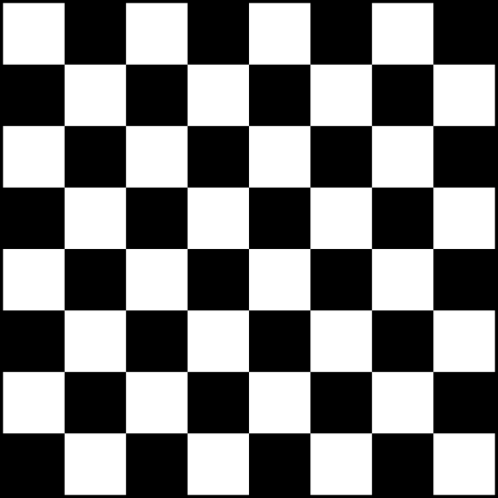

# CUDA Video Upscaler
Video and Image Upscaler built with **CUDA**.

## Modes
- Bilinear 2x

## Chess Pattern Image 600x600

## Chess Pattern Image 1200x1200

## Next Steps
- Bicubic mode
- Useful scale {2|4}
- FFmpeg stdin/stdout
- Video upscaling
- NVDEC/NVENC

## Build
- Visual Studio Code
- CUDA 13.0
- vcpkg: `stb_image`

