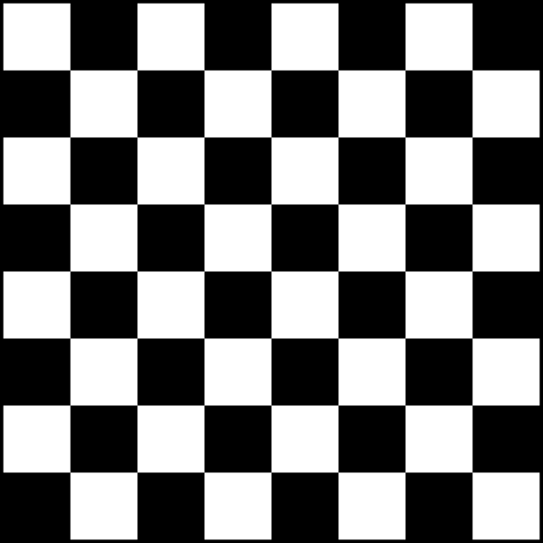
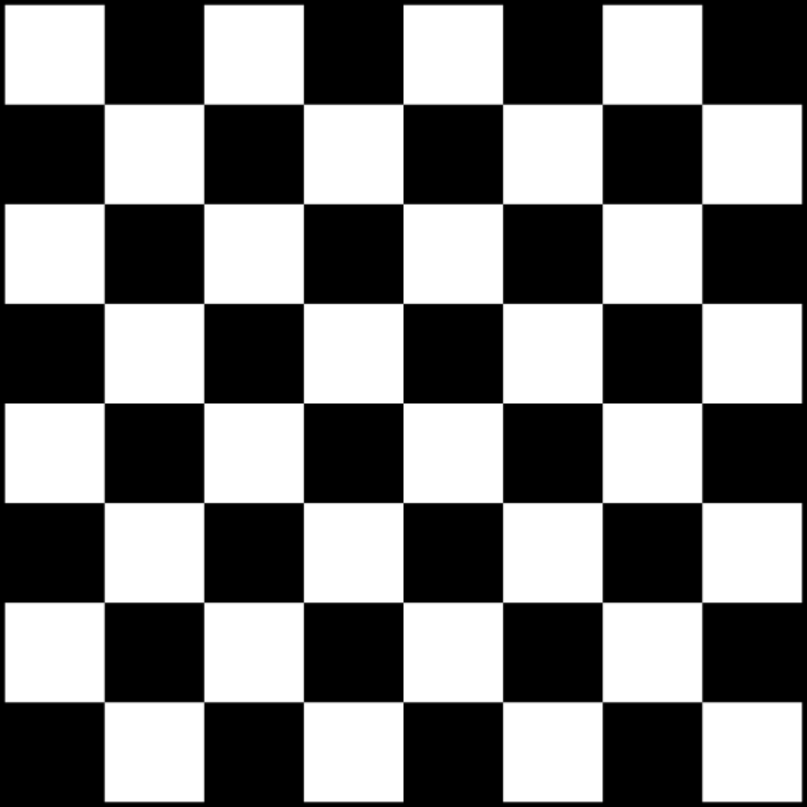
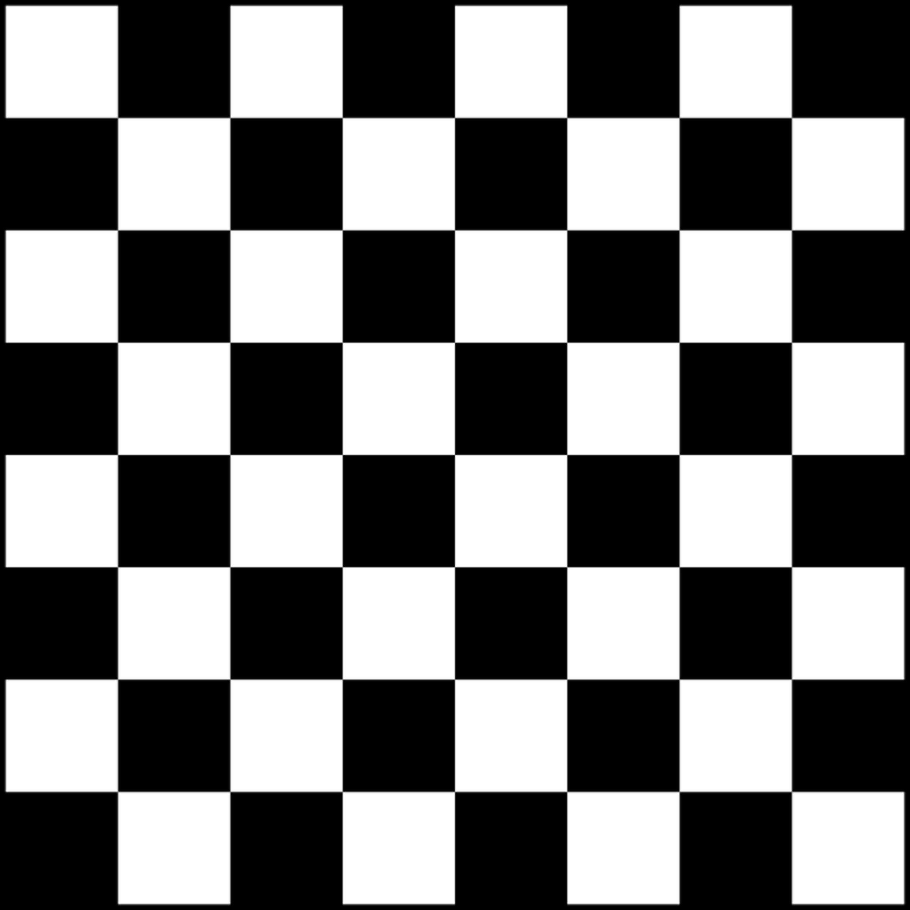

# CUDA Video Upscaler
High-performance **image and video upscaler** built with **CUDA**.

This project demonstrates image and video upscaling with bilinear and bicubic interpolation.
Demonstrates CUDA memory handling (pitched allocations, kernel launches) and CPU-GPU comparison.

# Devices 
- CPU 
- GPU(CUDA of course)

## Features
- Scale images x2 or x4
- Bilinear or Bicubic interpolation
- CPU and GPU(CUDA) execution


## Building:
Requirements:
- **CUDA 13.0** (or newer)
- **CMake 3.22+**
- **Visual Studio 2022**
- [**vcpkg**](https://github.com/microsoft/vcpkg) *(for stb_image dependency)*

```bash
cmake -S . -B build -DCMAKE_TOOLCHAIN_FILE=C:/tools/vcpkg/scripts/buildsystems/vcpkg.cmake
cmake --build build --config Release
```

__Commands:__
```bash
# CPU 
.\build\bin\Release\video_upscaler.exe imageIn.png .\imageOut.png --mode bilinear --scale 2 --device cpu

# CUDA
.\build\bin\Release\video_upscaler.exe imageIn.png .\imageOut.png --mode bilinear(or bicubic) --scale 2(or 4) --device cuda
```

## CLI Parametres 
```text
--mode      bilinear/bicubic
--scale     2/4
--device    cpu/cuda

```

## Chess Pattern Original Image - 600x600



## Chess Pattern Bilinear 2x Upscale - 1200x1200



## Chess Pattern Bicubic 4x Upscale - 2400x2400



## Next Steps
- FFmpeg stdin/stdout
- Video upscaling
- NVDEC/NVENC
- Performance comparison between CPU and GPU and stats

## Tech: 
> C++17, CUDA 13.0, CMake, stb_image, OpenMP

